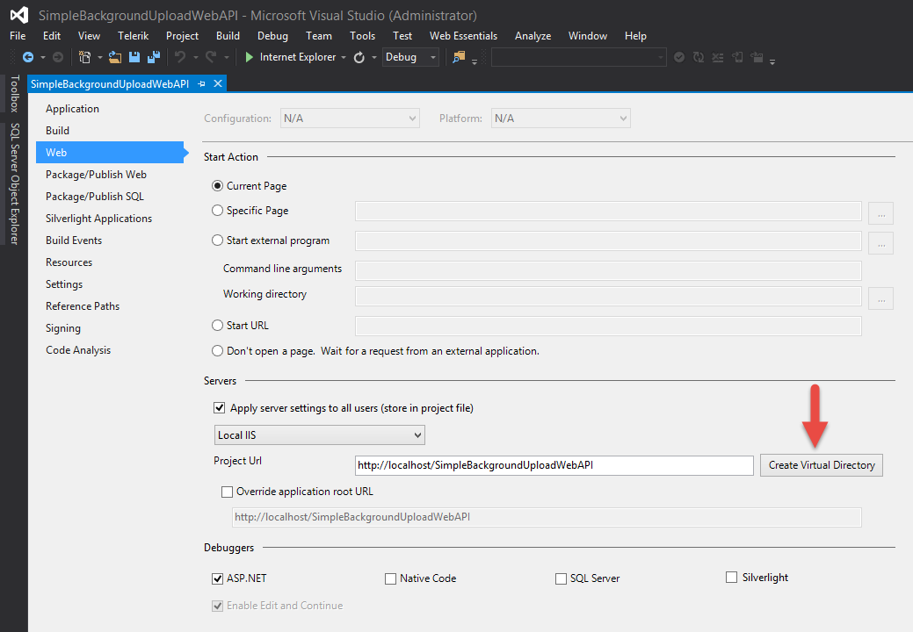

SimpleBackgroundUpload
======================

Xamarin.iOS sample using NSUrlSessionUploadTask to upload files while app is in the background.

Setup
-------

This sample consists of 2 projects, the Xamarin.iOS project and a ASP.NET Web API 2 project.

On the ASP.NET Web API 2 project:
1. Edit the project and configure how you want the Web API to run. In my case I set it to use Local IIS and set a custom project URL by creating a virtual directory.


2. Edit the FileController located @ SimpleBackgroundUpload\SimpleBackgroundUploadWebAPI\SimpleBackgroundUploadWebAPI\Controllers\ and modify the filePath variable to a directory on your PC.

```
// TODO: Set your local file path
filePath = @"C:\Temp\";
```


On the Xamarin.iOS project:
- Edit AppDelegate.cs file and change the webApiAddress variable to point to your local ASP.NET Web API.


Details
-------

This sample uploads a PDF from the Xamarin.iOS app to the ASP.NET Web API using a mulipart/form-data post request. The upload can be triggered by tapping the button on the screen or minimizing the iOS app.

Using a background NSUrlSession the upload is queued and started. Since the NSUrlRequest will occur in the background the content's body part is writen to disk and then passed to the upload task. Apple states it's in the app's benefit to write to disk so that it can release memory associated with that data. You will notice that the content-length is not specified on purpose as the session object will do that for us when not provided.

Our background session configuration uses the same identifier when created so that in the case the app is terminated by the system and relaunched, the app can use the same identifier to create a new configuration object and continute even if the app is suspended or terminated. See: https://developer.apple.com/library/ios/documentation/Foundation/Reference/NSURLSessionConfiguration_class/index.html#//apple_ref/occ/clm/NSURLSessionConfiguration/backgroundSessionConfigurationWithIdentifier:

Once the upload completes the SessionTaskDelegate's DidCompleteWithError is called and the response is checked to make sure the server returned HTTP status code 21 "Created". The ASP.NET Web API simply receives the multipart content, writes the file to disk and returns HTTPStatusCode.Created.

Please note that even though the upload task might complete while the app is in the background, the SessionDelegate method DidCompleteWithError might not be called until the app comes into the foreground.